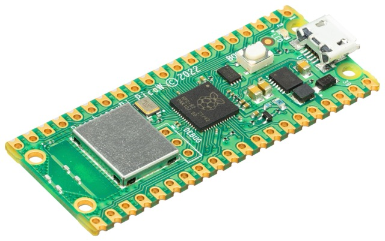
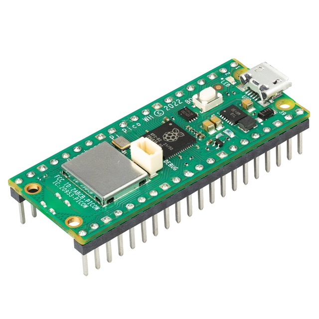
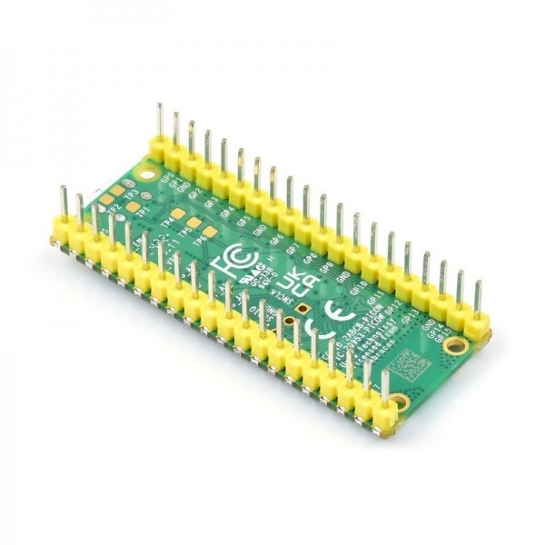
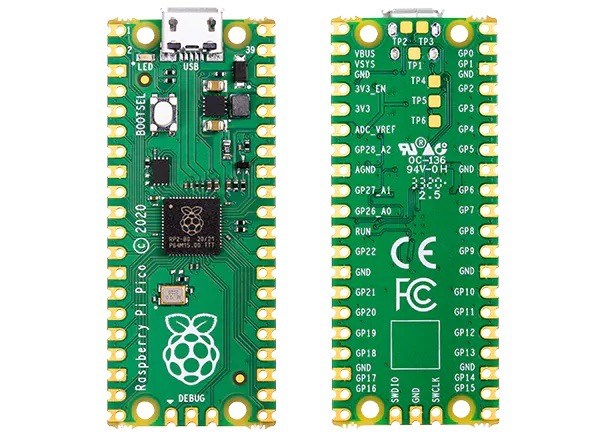
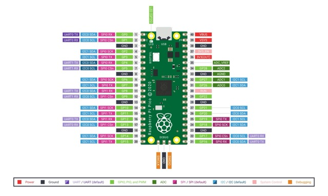

# Proyecto: Plantilla básica para comenzar proyectos en Raspberry Pi Pico con Micropython

El contenido de este repositorio tiene la única finalidad de utilizarse como
plantilla al crear otros proyectos reutilizando partes que suelo necesitar
de forma recurrente para acelerar el desarrollo.

Sitio web del autor: [https://raupulus.dev](https://raupulus.dev)

Repository [https://gitlab.com/raupulus/rpi-pico-template-project-micropython](https://gitlab.com/raupulus/rpi-pico-template-project-micropython)

Una de las ventajas es que en **Models** ya disponemos de dos modelos que
suelen ser fundamentales para mi: 

- API: Para interactuar fácilmente con mis apis enviando/recibiendo datos
- RpiPico: Representa a la raspberry: incluye conectividad wireless, gestión de
  ADC integrado, puede obtener información de la red y conectar a redes 
  alternativas por si nos desplazamos (usamos en varias ubicaciones) o 
  necesitamos un respaldo, información de temperatura...

Además de algunos parámetros básicos en el archivo de variables de entorno
que usamos como base **.env.example.py**

  
  
  
  

## Software y Firmware

- IDE/Editor (EJ: thonny, pycharm o vscode)
- [MicroPython 1.23](https://micropython.org/download/rp2-pico/) instalado 
  en la Raspberry Pi Pico.

## Contenido del Repositorio

- **src/**: Código fuente del proyecto.
- **src/Models**: Modelos/Clases para separar entidades que intervienen.
- **docs/**: Documentación adicional, esquemas y guías de instalación.

## Instalación

1. **Instalación de MicroPython:**
   - Asegúrate de que MicroPython esté instalado en tu Raspberry Pi Pico. Puedes seguir las instrucciones en la [documentación oficial](https://docs.micropython.org/en/latest/rp2/quickref.html).

2. **Cargar el Código:**
   - Descarga o clona este repositorio.
   - Copia el archivo *.env.example.py* a *env.py* y rellena los datos para 
     conectar al wireless además de la ruta para subir datos a tu API.
   - Copia los archivos en la carpeta `src/` a la Raspberry Pi Pico.

## Esquema de la raspberry pi pico

## Licencia

Este proyecto está licenciado bajo la Licencia GPLv3. Consulta el archivo 
LICENSE para más detalles.